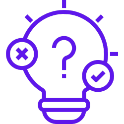
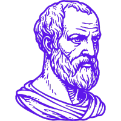
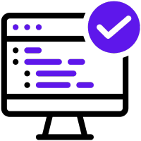
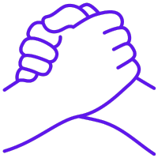
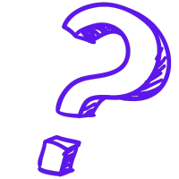

# A Jornada da Lógica: Da Filosofia à Tecnologia

Você também podeler esse artigo no Medium! <a href="https://medium.com/@sabrinabuenoprata/a-jornada-da-l%C3%B3gica-da-filosofia-%C3%A0-tecnologia-edc2a6f1a96a">Clique Aqui</a>

 
</img>

Como estudante de Engenharia de Software e curiosa, compreendendo os princípios da lógica de programação e a aplicação da lógica em minha área de estudo, tive o interesse de pesquisar e obter uma visão clara de como a lógica se desdobrou da filosofia à tecnologia ao longo do tempo e entender a relação entre suas fases e os estudos da lógica em cada uma delas. Encontrar um conteúdo que respondesse a todas as minhas questões foi uma missão quase impossível; mesmo os artigos que possuíam essa relação histórica deixaram a desejar, a meu ver, sendo incompletos e generalistas, abordando apenas o histórico da lógica ao longo do tempo de forma muito simplista, o que, claro, atendia à sua premissa, mas não ao conhecimento que eu desejava adquirir.

Com isso, após muita pesquisa e entendimento sobre feitos ao longo do tempo, cheguei a um artigo que respondeu à minha curiosidade e deixou tudo mais claro para mim. Compartilho o mesmo com vocês e desejo que seja proveitoso para outros adquirirem esse conhecimento, assim como foi para mim.

Lembrando que sou uma estudante e, em caso de afirmações dúbias ou algum erro, aceito com gratidão qualquer possível correção ou observação importante referente a este artigo.

 
</img>

# Parte 1 : Origens

### Origem Da Palavra - Lógica 

É o Latim "ARS LOGICA", do Grego "LOGIKE TEKHNE", que significa "arte de raciocinar", derivado de "LOGIKÓS", que se refere ao "raciocínio", proveniente de "LOGOS", que engloba "razão, ideia, palavra".

Com dois significados principais: discute o uso de raciocínio em alguma atividade e é o estudo normativo, filosófico do raciocínio válido. No segundo sentido, a lógica é discutida principalmente nas disciplinas de filosofia, matemática e ciência da computação. Ambos os sentidos se baseando no foco comum referente a harmonia de raciocínio, a proporcionalidade formal entre argumentos, assim sendo, a correta e equilibrada relação entre todos os termos, a total concordância entre cada um deles dentro de um desenvolvimento.

### O que é lógica?

Podendo referenciar tanto um conjunto de regras racionais para a obtenção de conhecimento quanto a área da filosofia que estuda a validade formal das proposições linguísticas matemáticas.

Como propriedade linguística, a lógica preocupa-se com a validade formal lógica, ou seja, com a possibilidade de sentido da frase dada por sua estrutura. Se a estrutura de uma frase estiver correta, seguindo um padrão formal adequado, podemos dizer que a frase é logicamente válida.

Na matemática, é a lógica que assegura a estrutura formal racional das equações e demais elementos matemáticos que, de algum modo, estão relacionados - tema que abordaremos mais adiante.

### Criação da Lógica? 

Na verdade, não podemos dizer que a lógica em si foi criada, mas sim descoberta. A lógica existe desde que a racionalidade existe; no entanto, quem a descobriu foi Aristóteles.

Os estudos da lógica foram iniciados, então, por Aristóteles, entre 384 a.C. e 322 a.C. na Grécia Antiga. Ao perceber que a maior distinção entre o ser humano e os demais animais é a linguagem, ele notou também que há uma estrutura linguística que deve ser obedecida para que os enunciados tenham sentido.

Ao formalizar uma ciência capaz de entender e classificar os elementos que permitem os enunciados linguísticos com sentido e validade, a lógica foi fundada.

 
</img>

# Parte 2: Logica Filosófica

### Primórdios da Lógica

A história da lógica remonta à Grécia Antiga, com figuras como Parmênides e Heráclito, que debatiam a natureza da realidade e a validade do raciocínio. No entanto, Tales de Mileto, um dos primeiros filósofos gregos, foi quem fez contribuições notáveis à lógica ao aplicar métodos algébricos como uma forma de exploração científica. Tales é famoso por sua abordagem matemática da geometria e suas contribuições ao cálculo, demonstrando como a lógica e a matemática se entrelaçavam na filosofia antiga.

### Lógica Aristotélica

Com seus estudos, Aristóteles descobriu que todo conhecimento válido emitido por enunciados deve respeitar três princípios básicos. 

Príncipio da identidade: o que enuncia a identidade dos seres e das coisas. Através do verbo o princípio diz o que certa coisa é. Como por exemplo, podemos dizer que “A é A”

Princípio da não-contradição: este príncipio diz que a identidade de algo não pode ser ela mesma e não ser ela ao mesmo tempo e sob o mesmo aspecto. É impossível que isto seja um texto e não seja um texto ao mesmo tempo e sob o mesmo aspecto. 

Princípio do terceiro excluído: algo é ou não é e não há terceira possibilidade. Pensando nos princípios anteriormente citados, podemos afirmar apenas que isto é um texto ou não é um texto, não havendo outra possibilidade, se isto for um automóvel, por exemplo, deixa de ser um texto. 

Os silogismos como expressão máxima da lógica aristotélica. Silogismo é uma estrutura linguística dedutiva, baseada em premissas e uma conclusão. Como estrutura dedutiva, o silogismo deve ter uma premissa maior, uma premissa menor e a partir delas uma conclusão. 

#### Exemplo:

- Premissa maior: Todo homem é mortal
- Premissa menor: Sócrates é homem
- Conclusão: Sócrates é mortal 

A lógica Aristotélica influenciou a filosofia e o pensamento científico por séculos, e suas contribuições perduram até os dias atuais. 

 
</img>

# Parte 3: Lógica Matemática

### Surgimento da Lógica Matemática

As contribuições de Tales de Mileto, anteriormente citadas, que incluem a aplicação de métodos matemáticos para resolver problemas práticos, podem ser vistas como precursores importantes para o desenvolvimento subsequente da lógica matemática e da álgebra. 

Até o final do século XIX a lógica manteve-se na esfera da filosofia, quando matemáticos como Geoge Boole e Augustus de Morgan, começaram a aplicar métodos lógicos à álgebra e à teoria dos conjuntos. Essa revolução deu origem à lógica matemática, que se baseia em símbolos e equações para representar o raciocínio formal. 

O que deu origem a uma nova ciência, onde as possibilidades de verdade e falsidade são avaliadas através de sua forma lógica. As sentenças são transformadas em elementos matemáticos e analisadas a partir de duas relações entre valores lógicos.

### Relações Entre Valores Lógicos.

### Proposições

As proposições são palavras ou símbolos que expressam um pensamento com um sentido completo e indicam afirmações de fatos ou ideias. 

Para ser uma proposição é necessário que tenha clareza e definição, de modo que seu valor de verdade seja facilmente determinado. 

#### Exemplo:

- A Terra é um dos planetas do sistema solar. 
- 2 + 2 = 4 

Ambas as afirmações podem ser consideradas como proposições, pois é possível identificar se seu valor é verdadeiro ou falso. 

As afirmações podem ser verdadeiras ou falsas, mas não ambas e também não há a possibilidade de uma terceira condição. Para representar uma proposição comumente são utilizadas as letras p e q.

Proposições simples: apresentam apenas uma sentença

Proposições compostas: quando são formadas pela combinação de duas ou mais proposições simples. 

### Conectivos

Aquilo que liga duas proposições simples que formarão uma proposição composta. Também é possível utilizar conectivos para modificar uma proposição. 

#### Exemplos: 

- “O céu é azul e as nuvens são brancas” o elemento e é um conectivo
- “O céu não é azul” o conectivo não modifica a proposição

### Tabela Verdade

Usada para determinar o valor de verdade de preposições compostas com base nas possíveis combinações de verdade ou falsidade a tabela verdade é uma representação de todas as combinações possíveis. Permitindo analizar e compreender as relações lógicas entre as proposições componentes. 

### Principais elementos e conceitos associados a uma tabela verdade: 

#### Proposições Componentes: 

São as proposições simples que irão formar proposições compostas. Cada uma sendo representada por uma variável, frequentemente letras como “p”, “q”, “r”, etc. 

#### Combinando Valores de Verdade: 

A tabela-verdade lista todas as combinações possíveis dos valores de verdade das proposições componentes. 

#### Proposições Compostas: 

Depois de listar todas as combinações possíveis, são incluídas colunas para cada proposição composta que esta sendo avaliada. As proposições compostas são formadas combinando proposições componentes (proposições simples) com conectivos lógicos. 

#### Conectivos Lógicos: 

- E (conjunção)
- OU (disjunção)
- NÃO (negação)
- IMPLICA (implicação)
- SE (condicional)
- SE E SOMENTE SE (bicondicional)

#### Atribuição de Valores de Verdade: 

Para cada combinação de valores de verdade das proposições componentes, a tabela-verdade atribui um valor de verdade às proposições compostas com base nas regras dos conectivos lógicos, como: 

Conjunção: Sendo verdadeira apenas quando as proposições componentes são verdadeiras. 
Disjunção: Sendo verdadeira apenas se pelo menos uma das proposições componentes for verdadeira. 

#### Avaliação das Proposições Compostas: 

A tabela-verdade exibe os valores de verdade das proposições compostas para cada combinação de valores de verdade das proposições componentes. Isso permite determinar quando uma proposição composta é verdadeira ou falsa. 

A tabela-verdade é uma ferramenta poderosa para analisar a lógica das proposições compostas e verificar a validade de argumentos lógicos. Sendo frequentemente usada nas disciplinas onde a precisão e a validade do raciocínio são essenciais. 

Se deseja aprender mais sobre a tabela-verdade, <a href="https://www.todamateria.com.br/tabela-verdade/">clique aqui!</a>

Agora, antes do próximo passo na jornada da lógica, um adendo; para quem estuda ou trabalha com programação ou áreas relacionadas, além da filosofia e da matemática é claro, nesta altura provavelmente ja se deparou com conceitos conhecidos, pode encontrar paralelos e até entender de onde surgiram certas linhas de racíocinio, o que apesar de parecer simples ou até “lógico” para alguns, é exatamente a proposta deste artigo, explorar o que é a lógica que tanto falamos e como a mesma se desdobrou até se tornar um objeto de estudo a parte nas áreas de tecnologia. Com isso seguimos. 

 
</img>

# Parte 4: Lógica de Programação

## O Que é a Lógica De Programação? 
	
A logica de programação é a aplicação prática da lógica matemática na resolução de problemas computacionais. Ela se concentra na formulação de algoritmos, que são sequências de instruções lógicas e precisas. 

Linguagens de programação são utilizadas para criar algoritmos e instruções que dizem ao computador como realizar tarefas específicas.

## Porque um programador deve entender a lógica de programação?

O raciocínio lógico de um programador é uma de suas maiores ferramentas de trabalho.Ao aguçar o raciocínio lógico do programador, ele está mais próximo da maneira de pensar de um computador e, portanto, mais habilidoso na hora de desenvolver um código eficiente.

Os computadores são incapazes de compreender ordens subjetivas e que não estejam ordenadas de acordo com a sua maneira de compreender.

Ao estudar lógica de programação, estamos estudando também a maneira como a tecnologia funciona de modo geral.

##  Os Principais Conceitos Associados a Lógica de Programação: 

### Algoritmo

Um algoritmo é uma sequência de passos lógicos que descreve como realizar uma tarefa específica. As informações em um algoritmo não podem ser redundantes ou subjetivas, elas precisam ser claras e detalhadas.

Os algoritmos são como uma receita, uma instrução para o computador, com etapas claras para que os comandos funcionem com exatidão.

### Exemplo de Algoritmo: 

Fazer uma xícara de café (tendo uma cafeteira): 

1. Início
2. Pegue uma xícara e uma colher.
3. Abra o armário onde você guarda o café e retire o pote de café.
4. Abra a tampa do pote de café.
5. Insira a colher no pote de café e pegue a quantidade desejada de café (por exemplo, uma colher de “sopa”).
6. Coloque o café no filtro da cafeteira.
7. Encha o reservatório de água da cafeteira com a quantidade desejada de água (geralmente, uma xícara de água por cada colher de café).
8. Ligue a cafeteira.
9. Espere alguns minutos para que o café seja preparado.
10. Quando a cafeteira terminar de fazer o café, desligue-a.
11. Com cuidado, despeje o café da jarra na sua xícara.
12. Adicione açúcar e/ou leite, se desejado.
13. Mexa o café com a colher para misturar os ingredientes adicionais.
14. Deixe o café esfriar por um momento, se estiver muito quente.
15. Desfrute do seu café!
16. Fim

Este é um exemplo simples de um algoritmo que descreve uma tarefa cotidiana.

Obs. Se você for um programador(a) provavelmente tentará achar falhas no algoritmo do café usado para exemplo e provavelmente encontrará, pois o principal objetivo é exemplificar de forma simples, principalmente para leigos que possam vir a ler este artigo, o que é um algoritmo, tornando-o acessível. 

Desta maneira, complemento principalmente para estudantes, que em um algoritmo é importante o detalhamento de cada ação, considerando todo o cenário e que uma etapa mal especificada ou descrita, pode quebrar seu algoritmo, portanto é importante aprofundar-se no assunto. 

#### Recomendação de leitura: 
Entendendo Algoritmos: Um Guia Ilustrado Para Programadores e Outros Curiosos
Por: Aditya Y. Bhargava

## Sequência

A lógica de programação envolve a definição da sequência em que as as ações devem ser executadas pelo computador. A sequência determina a ordem em que as instruções são executadas. 

Assim, a sequência basicamente diz quando cada instrução deve ser realizada. 

Utilizando do exemplo de algoritmo acima, a sequência errada das instruções poderia acerretar no não funcionamento do algoritmo para o preparo do café, como executar o passo 15. Desfrute do seu café antes do passo 11. Com cuidado, despeje o café da jarra na sua xícara. Por exemplo. 

“Pois para que seja possível desfrutar é necessário antes ter despejado o café na xícara.”

## Estruturas de Controle

São usadas para alterar o fluxo de um programa através de instruções, são acionadas por meio de palavras ou expressões reservadas ou chaves. 

Com as instruções é possível esclarecer ao computador o que e como processar os dados relacionados a um problema computacional, partindo de uma situação inicial a outra desejada pelo usuário, chamada de situação final. 

As estruturas de controle de dados comuns incluem:

Estruturas de decisão (condicionais): Permitem que o programa tome decisoes com base em condições, como “se…então…senão…”

Que basicamente são os nossos conhecidos:

“if…else if….else” 
*Em JavaScript

#### OU

“if….elif…else
*Em Python

Por exemplo. 	

Laços (loops): Permitem que um conjunto de instruções seja executado repetidamente enquanto uma condição for verdadeira, como: “enquanto…” ou “para cada…” 

#### Exemplo: Programa para contar de 1 a 5.

Ao invés de contar de 1 a 5 conferindo a cada soma se o número passou de 5, pode ser simplificado, iniciando um loop de contagem em 1, atualizar somando um ao número e adicionar uma condição de parada, como: já passou do limite 5. 

#### Tipos de Loops:

For Loops 
Loops While
Loops faça-enquanto
Loops for-each

<b>Sub-rotinas (funções ou procedimentos):</b> Permitem que blocos de código sejam chamados e executados repetidamente em locais diferentes do programa. 

#### Tipos de sub-rotinas:

<b>Funções:</b> retornam um valor como resultado do processamento;
Procedimentos: não retornam valor.

### Variáveis

As variáveis são usadas para armazenar dados temporários que podem ser modificados ou consultados durante a execução de um programa. 

Variáveis são como caixinhas em que podemos guardar um dado que posteriormente poderá ser manipulado. Dar nome e tipo a essa caixinha é chamado de declaração de variável. 

#### Tipos de variáveis:

- Int: Utilizadas para definir números inteiros, positivos ou negativos.

- float: Utilizadas parar armazenar números reais. Empregadas em operações simples que contenham números com duas casas decimais. 

- double: São semelhantes às variáveis float. Permitem armazenamento de números com ponto flutuante, porém com o dobro da capacidade das variáveis float. 

- char: Utilizado para armazenar um único caractere (como uma letra). Não pode ser usado em operações matermáticas pois o software interpretará o conteúdo como uma letra. 

- string: Utilizadas para armazenamento de faixas de texto. Não podem ser adotadas em operações matemáticas.

- boolean: Implementadas com o núnico objetivo de adotar valores de verdadeiro ou falso. Permitindo ao software validar registros, definir passos, ou automatizar processos.

### Entrada e Saída

A lógica de programação envolve a definição de como um programa interage com os dados de entrada (dados que entram no programa) e como ele fornece os resultados ou saídas (dados gerados pelo programa).

<b>Exemplo:</b> Entrada e saída padrão de um computador

- Teclado: Entrada (você digita e envia um dado, este é um dado de entrada)
- Monitor: Saída (o texto digitado aparece no seu monitor, este é um dado de saída, uma resposta)

### Depuração (debbugging) 

Erros de programação são denominados bugs e o processo de encontrar e corrigir bugs é chamado de depuração ou debugging. O nome vem de uma mariposa encontrada no meio de um computador de Harvard, em 1947. 

A lógica de programação requer a capacidade de analisar um programa em busca de erros lógicos e corrigi-los. 

#### Tipos de erros que podem ocorrer em um programa: 

- Sintaxe
- Execução
- Semântica

### Abstração

A abstração envolve a simplificação de problemas complexos, quebrando-os em tarefas menores e mais gerenciáveis. Isso ajuda os programadores a lidar com a complexidade e a criar soluções eficazes. 

### Eficiência 

Na lógica de programação é considerada a eficiência de um programa, ou seja, a capacidade de realizar tarefas de maneira otimizada, economizando recursos de hardware e tempo de execução. 

Paradigmas de Programação e Orientação a Objetos

Os paradigmas de programação representam diferentes abordagens filosóficas e lógicas para a construção de software, e a transição ao longo do tempo reflete a busca por métodos mais eficientes e compreensíveis. A evolução dos paradigmas é uma jornada que ilustra a mudança na perspectiva sobre como organizar o pensamento e a lógica de programação.

### Orientação a Objetos:

Filosofia Baseada em Objetos:

#### Características: 

Modela o mundo real em termos de objetos, encapsulando dados e comportamentos.
Exemplo Histórico: Introduzida por linguagens como Simula e popularizada por Java, C++.

#### Lógica Envolvida: 

Abstração de entidades reais em objetos, promovendo encapsulamento e modularidade.

A evolução dos paradigmas de programação representa uma busca contínua por métodos mais eficazes e compreensíveis de expressar a lógica dos programas. A transição para a Orientação a Objetos é um marco significativo, incorporando a ideia de modelar o mundo real em termos de objetos, alinhando-se de maneira lógica com a complexidade crescente dos sistemas de software.

Confira mais sobre o assunto clicando <a href="https://guia.dev/pt/pillars/languages-and-tools/programming-paradigms.html#:~:text=Sendo%20assim%2C%20um%20paradigma%20de,possibilitar%20a%20resolu%C3%A7%C3%A3o%20de%20problemas.">aqui</a>!

### Atualidade: Inteligência Artificial e Lógica Complexa 

No cenário atual, a lógica de programação está na inteligência artificial. Algoritmos complexos, aprendizado de máquina e redes neurais demandam uma compreensão profunda da lógica para criar sistemas avançados.

“Ainda que o estudo da lógica no contexto da IA seja extremamente amplo, sua base é composta pela Lógica Proposicional, ou Álgebra de Boole, e a Lógica de Segunda Ordem, ou Lógica de Predicados. Ambas fornecem uma sintaxe que especifica como escrever e transformar expressões válidas na lógica e uma semântica, que especifica o que estas expressões significam na mesma lógica. De forma sucinta, a sintaxe diz respeito a manipular os símbolos e expressões de forma coerente com a lógica, enquanto a semântica é responsável por atribuir valores efetivos para as expressões resultantes (e.g. Verdadeiro ou Falso). A Lógica de Segunda Ordem expande significativamente a Lógica Proposicional, sendo mais expressiva: é capaz de representar coisas que não são possíveis de serem representadas na Lógica Proposicional. Outras lógicas são também definidas com propósitos específicos, como a Lógica Modal que permite a representação de coisas como a passagem do tempo.” - Ricardo Araujo  (Professor de Ciência da Computação da UFPel. Praticante e pesquisador de Machine Learning e Inteligência Artificial.).

Aqui são mencionados termos que vimos anteriormente, lá no inicio, passando pela lógica filosófica e matemática, o que ressalta a importância do entendimento desse histórico assim como a relação próxima que ainda se vê hoje com estudos filosóficos da lógica.

 
</img>

### Relação entre Lógica Filosófica e Lógica de Programação

A relação entre a lógica filosófica e a lógica de programação é profunda e multifacetada. Ambas compartilham o objetivo de estabelecer regras para um raciocínio válido e consistente. Na filosofia, a lógica é usada para analisar argumentos e avaliar a validade das inferências. Na programação, a lógica é usada para controlar o fluxo de um programa e garantir que ele funcione de acordo com as especificações.

Além disso, a lógica de programação se beneficia diretamente das contribuições da lógica matemática, que se originou da lógica filosófica. Os operadores lógicos, como AND, OR e NOT, têm raízes na álgebra booleana de George Boole, que, por sua vez, foi influenciada pelos princípios da lógica aristotélica.

 
</img>

### Por Que Estudar Lógica?

O estudo da lógica é benéfico para todos os indivíduos, sendo das áreas de filosofia, matemática e tecnologia ou não. Ao estudar lógica tornamo-nos capazes de analizar situações com clareza, dividir tarefas adequadamente e resolver problemas, inclusive problemas cotidianos. Permite o desenvolvimento de habilidades essênciais, seja em contexto profissional ou pessoal.

O estudo da lógica capacita os indivíduos a enfrentar desafios de maneira mais eficaz, promovendo uma abordagem mais criteriosa e racional diante das complexidades da vida.
Conclusão

A jornada da lógica, desde sua origem na filosofia antiga até sua aplicação na tecnologia moderna, demonstra a continuidade e a importância dessa disciplina ao longo da história. A lógica filosófica forneceu as bases para o desenvolvimento da lógica matemática, que, por sua vez, deu origem à lógica de programação. Essa evolução é evidência clara de como o pensamento lógico é uma habilidade essencial, independentemente do campo de atuação. 

Desenvolvedores de software, em particular, continuam a usar a lógica para criar sistemas complexos e resolver problemas de maneira eficaz. Assim, a jornada da lógica da filosofia à tecnologia destaca a importância do pensamento lógico como um alicerce sólido em nossa busca pelo conhecimento e pelo progresso tecnológico.

### Referências: 

<a href="https://mundoeducacao.uol.com.br/filosofia/logica.htm ">Mundo Educação - Filosofia</a>

<a href="https://origemdapalavra.com.br/palavras/logica/">Origem da Palavra</a>

<a href="https://pt.wikipedia.org/wiki/L%C3%B3gica#:~:text=L%C3%B3gica%20 ">WikiPedia - Lógica</a>

 <a href="https://www.todamateria.com.br/o-que-e-logica">Toda Materia - O que é logica?</a>

<a href="https://www.educamaisbrasil.com.br/enem/matematica/logica-matematica">Educa Mais Brasil - Matematica</a>

<a href="https://www.todamateria.com.br/logica-matematica/ ">Toda Materia - Logica Matematica</a>

<a href="https://www.todamateria.com.br/tabela-verdade/"> Toda Materia - Tabela Verdade</a>

<a href="https://blog.casadodesenvolvedor.com.br/logica-de-programacao/#:~:text=Enquanto%20a%20l%C3%B3gica%20de%20programa%C3%A7%C3%A3o,ou%20para%20atingir%20determinado%20objetivo. ">Casa do Desnvolvedor - O que é e como funciona a lógica de programação</a>

<a href="https://www.hostgator.com.br/blog/logica-de-programacao/">HostGator - Logica de Programação</a>

  <a href="https://kenzie.com.br/blog/logica-de-programacao/"> Kenzie - Lógica de programação: o que é e por que é importante </a>

 <a href="http://nuted.ufrgs.br/oa/animak/logica.php#:~:text=A%20Seq%C3%BC%C3%AAncia%20L%C3%B3gica%20pode%20ser,(obedecendo%20a%20seq%C3%BC%C3%AAncia%20l%C3%B3gica).">UFRGS - Lógica de programação</a>

 <a href="https://caderno.medium.com/l%C3%B3gica-de-programa%C3%A7%C3%A3o-3d36145c0d8c">Medium - Lógica de programação</a>

 <a href="https://sae.unb.br/cae/conteudo/unbfga/apc/new_estruturadecontrole.html">UNB - Estruturas de Controle</a>

 <a href="https://developer.mozilla.org/pt-BR/docs/Web/JavaScript/Reference/Statements/if...else">MDN - Documentação JavaScript</a>

 <a href="https://panda.ime.usp.br/cc110/static/cc110/05-if.html">Panda - Execução condicional e alternativas</a>

 <a href="https://rockcontent.com/br/talent-blog/estruturas-condicionais-2/">RockContent - O que são estruturas condicionais? </a>

<a href="https://idocode.com.br/blog/programacao/o-que-e-um-loop/ ">I do code - O que é um loop (laço) em programação?</a>

 <a href="https://www.professores.uff.br/juanbrettas/wp-content/uploads/sites/114/2017/08/5-Subrotinas-2.pdf">UFES - Sub-rotinas</a>

 <a href="http://www.inf.ufes.br/~vitorsouza/archive/2020/wp-content/uploads/academia-br-programacaoc-aula07.pdf">UFES - Programação</a>

 <a href="https://www.people.com.br/noticias/informatica/o-que-sao-variaveis-e-para-que-elas-servem-na-programacao">People - Variáveis</a>

 <a href="https://aws.amazon.com/pt/what-is/debugging/#:~:text=Depura%C3%A7%C3%A3o%20corresponde%20ao%20processo%20de,determinar%20as%20causas%20dos%20erros.">AWS - O que é depuração</a>

 <a href="https://www.inf.pucrs.br/flash/progbio/aulas/seq/build/progbio/WhatisDebugging.html">
PUCRS - O que é depuração</a>

 <a href="https://ricardomatsumura.medium.com/l%C3%B3gica-em-intelig%C3%AAncia-artificial-fa0753fdffcc">Medium - Lógica em Inteligência Artificial</a>

